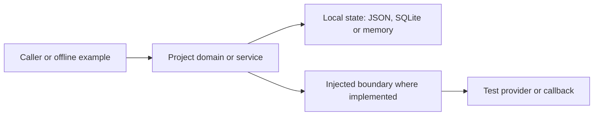

# Architecture and engineering progression

[Portfolio](../README.md)

This is a modular Python monorepo. Each named project directory is a package; commands run from the repository root without installation. The common test suite exercises behavior and README examples. Shared conventions do not imply that the projects form one deployed system.

## Boundaries at a glance

This diagram summarizes recurring boundaries, not a universal plugin framework. The weather module has a concrete HTTP function alongside a separately testable parser. TaskManager depends directly on sqlite3. Commerce injects a payment callable; the assistant injects a provider. Only the REST reference defines a repository Protocol.

## Progression and trade-offs

| Stage | Concrete evidence | Design question |
| --- | --- | --- |
| Programming | Calculator operator table and finite-number checks | What inputs are accepted and how do failures surface? |
| Data and persistence | Expense JSON round trip; SQLite task queries | Who owns state, serialization and the database connection? |
| APIs and backend | Weather parser; item service returning status/body pairs | What can be verified without the network or a real database adapter? |
| Reliability | Bounded metric histories; inventory compensation | Which resources are bounded, and what does rollback actually restore? |
| AI integration | Context retrieval and an injected provider | What is sent to a provider, and what safety claims are unsupported? |
| Systems design | Locked scheduler with leases and retry limits | How do crashed workers expire, and what remains process-local? |

## Failure semantics worth inspecting

- Payment rejection returns a rejected order and restores stock. Exceptions also restore local stock and propagate; an uncertain external charge needs reconciliation, not blind retry.
- Scheduler finish rejects an expired lease or the wrong worker. Expired final attempts become FAILED when get/claim inspects state. Unique worker identities are required per execution attempt because there is no fencing token.
- The assistant rejects oversized questions and likely secret patterns in selected documents/path names before invoking its provider. This is not comprehensive secret detection, prompt-injection protection or answer-quality evaluation.
- Metrics bound samples per metric, not the number of metric names. The scheduler and commerce store are not durable.

## What is not implemented

There is no running PostgreSQL adapter, HTTP REST server, distributed queue, service deployment, live LLM test, authentication system or load-test evidence. Adding these is future work, not required to inspect the existing reference behavior. Individual project READMEs list narrower limits.

## Presentation layer

The static site in [`index.html`](../index.html) is a thin, dependency-free shell. [`portfolio-data.js`](../portfolio-data.js) is the single source of truth for the 15 featured projects (`name`, `repo`, `demo`, status and focus); `script.js` renders cards and the demo modal, `styles.css` provides a light-first responsive theme, and the GitHub Pages workflow copies the [offline demos](../demos/) next to the site. Each demo avoids external calls and marks simulation/animation boundaries explicitly, so inspecting a project never requires a live provider or credentials.

## Verification and recovery

Run the root compile/test commands. CI uses the same commands on three Python versions, with read-only repository permissions and no credentials. Clone an existing Git commit or tag into an unused directory to inspect an earlier version; no generated databases or external services are needed for the tests.
